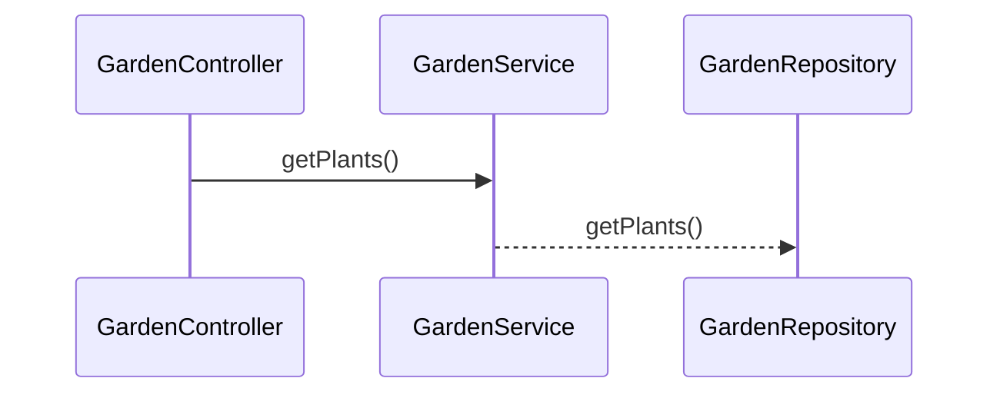

# spring-boot-archetype
Sample spring boot archetype to generate a custom REST service and can be used to bootstrap microservice development.  The archetype will also produce scripts to package the microservice in a docker container.

The archetype will generate 4 main classes
- Controller class
- Service  Class
- Repository Class
- Model Class

The following sequence diagram depicts the flow


The rest service's controller autowires a business service class.  The business service class autowires a repository class which needs to be customized to retrieve data from database, etc.  

The archetype will generate a skeleton project with the following technologies.

| Framework |
| --------- |
| [Spring Boot](https://spring.io/) |
| [Microservices with Spring](https://spring.io/microservices) |
| [Swagger](https://swagger.io/) |
| [lombok](https://projectlombok.org/) |
| [docker|(https://www.docker.com/) |
| [Jacoco](https://www.jacoco.org/jacoco/) |
| [Mockito](https://site.mockito.org/) |

## Sample usage of the archetype

```
mvn archetype:generate -DarchetypeGroupId=org.example \
 -DarchetypeArtifactId=springboot-archetype \
 -DarchetypeVersion=1.0-SNAPSHOT \
 -DgroupId=org.example.garden \
 -DartifactId=RaisedBedGarden \
 -Dversion=1.0-SNAPSHOT \
 -DmodelClass=Plant \
 -Dname=RaisedBedGarden \
 -Ddescription='Raised Bed Garden ' \
 -DrestEndpoint=/api/v1/garden \
 -DserviceName=Garden
 ```

## Properties

The archetype can be customized with the following properties
```
   <requiredProperties>
        <requiredProperty key="yourName">
            <defaultValue>Elmer Fudd</defaultValue>
        </requiredProperty>
        <requiredProperty key="yourUrl">
            <defaultValue>https://www.linkedin.com/in/</defaultValue>
        </requiredProperty>
        <requiredProperty key="licenseUrl">
            <defaultValue>https://www.gnu.org/licenses/gpl-3.0.html</defaultValue>
        </requiredProperty>
        <requiredProperty key="name">
            <defaultValue>GarbageCollector</defaultValue>
        </requiredProperty>
        <requiredProperty key="description">
            <defaultValue>GarbageCollector collects trash and hauls it to the dump.</defaultValue>
        </requiredProperty>
        <requiredProperty key="serviceName">
            <defaultValue>Trash</defaultValue>
        </requiredProperty>
        <requiredProperty key="modelClass">
            <defaultValue>GarbageCan</defaultValue>
        </requiredProperty>
        <requiredProperty key="primaryKeyType">
            <defaultValue>String</defaultValue>
        </requiredProperty>
        <requiredProperty key="restEndpoint">
            <defaultValue>/api/v1/garbage</defaultValue>
        </requiredProperty>
    </requiredProperties>

```
