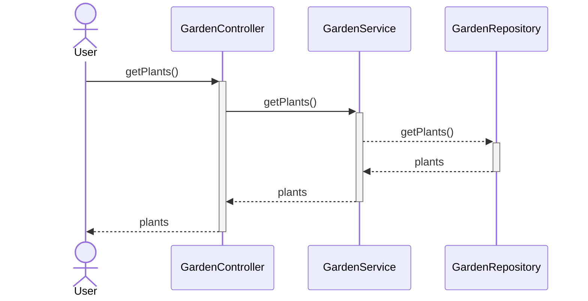

 
# org.example - spring-boot-archetype

Sample spring boot archetype to generate a custom REST service and can be used to bootstrap microservice development.  The archetype produces scripts to package the microservice in a docker container.

```
mvn archetype:generate -DarchetypeGroupId=org.example  -DarchetypeArtifactId=springboot-archetype  -DarchetypeVersion=1.0-SNAPSHOT
```

## Overview

The intent of this archetype is to bootstrap the development of a microservice. The intent is not to generate a full application but a minimal application that you can customize for your requirements. The archetype generates a simple get endpoint where the controller deals with the REST endpoint logic and delegates to the service class for the business logic, which also in turn delegates to the repository class to persist model objects.  Then you can package the microservice in a docker container and deploy it. Scripts to build the docker image are also provided.  You may want to use a different base image. 

| Class      | Description |
| ---------- | ------------------------------------------------------------------------------------------- |
| Controller | This is the @RestController and provides the @GetMapping to get a list of Model Objects. The get endpoint is integrated with Swagger for testing. |
| Service | This is a @Component and is autowired in the Controller.  Here you would write business logic on your model objects.  |
| Repository | This is a @Component and is autowired in the Service.  Here you would put your database mappings to retrieve model objects.|
| Model | This is a lombok model object annotated with @Data.  Here you would define the different attributes required by your problem domain. |

The archetype also produces unit tests for the controller, service and repository classes using mockito. The produced pom file also has Jacoco configured to measure unit test converage. The minimum coverage is set to 0 so that you can turn it on when and if you need it. 

The archetype will generate a skeleton project with the following technologies.

| Framework |
| --------- |
| [Spring Boot](https://spring.io/) |
| [Microservices with Spring](https://spring.io/microservices) |
| [Swagger](https://swagger.io/) |
| [lombok](https://projectlombok.org/) |
| [docker](https://www.docker.com/) |
| [Jacoco](https://www.jacoco.org/jacoco/) |
| [Mockito](https://site.mockito.org/) |


# Garden

A sample Garden microservice generated by the archetype has the following classes: GardenController, GardenService, GardenRepository and model class Plant.

The following sequence diagram depicts the flow


## GardenController
```
package org.example.garden.controller;

import org.example.garden.model.*;
import org.example.garden.service.GardenService;

import io.swagger.v3.oas.annotations.Operation;
import lombok.extern.slf4j.Slf4j;

import org.springframework.http.HttpStatus;
import org.springframework.http.ResponseEntity;
import org.springframework.web.bind.annotation.*;

import java.util.List;

// http://localhost:8080/swagger-ui.html
@Slf4j
@RestController
@RequestMapping("/api/v1/garden")
public class GardenController {
    private GardenService gardenService;
    public GardenController(GardenService gardenService) {
        this.gardenService = gardenService;
    }

    @GetMapping("/plants/{id}")
    ResponseEntity<List<Plant>> getPlants(@PathVariable String id) {
        List<Plant> plants = gardenService.getPlants(id);

        return new ResponseEntity<>(plants, HttpStatus.OK);
    }
}

```
## GardenService
```
package org.example.garden.service;

import org.example.garden.model.*;

import java.util.List;

public interface GardenService {
    List<Plant> getPlants(String id);
}
```
## GardenServiceImpl
```
package org.example.garden.service.impl;

import org.example.garden.model.*;
import org.example.garden.repository.GardenRepository;
import org.example.garden.service.GardenService;

import org.springframework.stereotype.Component;
import lombok.extern.slf4j.Slf4j;

import java.util.List;

@Component
@Slf4j
public class GardenServiceImpl implements GardenService {
    private GardenRepository gardenRepository;

    public GardenServiceImpl(GardenRepository gardenRepository) {
        this.gardenRepository = gardenRepository;
    }

    @Override
    public List<Plant> getPlants(String id) {
        log.info("getPlants(String {}) ", id);
        return gardenRepository.getPlants(id);
    }
}

```

## GardenRepository
```
package org.example.garden.repository;

import org.example.garden.model.*;

import java.util.List;

public interface GardenRepository {
    List< Plant> getPlants(String id);
}
```

## GardenRepositoryImpl
```
package org.example.garden.repository.impl;

import org.example.garden.model.*;
import org.example.garden.repository.GardenRepository;

import org.springframework.stereotype.Component;
import lombok.extern.slf4j.Slf4j;

import java.util.ArrayList;
import java.util.List;

@Component
@Slf4j
public class GardenRepositoryImpl implements GardenRepository {
    @Override
    public List<Plant> getPlants(String id) {
        log.info("getPlants(String {}) ", id);
        List<Plant> plants = new ArrayList<>();
        Plant plant = new Plant();
        plant.setId(id);
        plants.add(plant);
        return plants;
    }
}

```

## Sample usage of the archetype

```
mvn archetype:generate -DarchetypeGroupId=org.example \
 -DarchetypeArtifactId=springboot-archetype \
 -DarchetypeVersion=1.0-SNAPSHOT \
 -DgroupId=org.example.garden \
 -DartifactId=RaisedBedGarden \
 -Dversion=1.0-SNAPSHOT \
 -DmodelClass=Plant \
 -Dname=RaisedBedGarden \
 -Ddescription='Raised Bed Garden ' \
 -DrestEndpoint=/api/v1/garden \
 -DserviceName=Garden
 ```

## Properties

The archetype can be customized with the following properties
```
   <requiredProperties>
        <requiredProperty key="yourName">
            <defaultValue>Elmer Fudd</defaultValue>
        </requiredProperty>
        <requiredProperty key="yourUrl">
            <defaultValue>https://www.linkedin.com/in/</defaultValue>
        </requiredProperty>
        <requiredProperty key="licenseUrl">
            <defaultValue>https://www.gnu.org/licenses/gpl-3.0.html</defaultValue>
        </requiredProperty>
        <requiredProperty key="name">
            <defaultValue>GarbageCollector</defaultValue>
        </requiredProperty>
        <requiredProperty key="description">
            <defaultValue>GarbageCollector collects trash and hauls it to the dump.</defaultValue>
        </requiredProperty>
        <requiredProperty key="serviceName">
            <defaultValue>Trash</defaultValue>
        </requiredProperty>
        <requiredProperty key="modelClass">
            <defaultValue>GarbageCan</defaultValue>
        </requiredProperty>
        <requiredProperty key="primaryKeyType">
            <defaultValue>String</defaultValue>
        </requiredProperty>
        <requiredProperty key="restEndpoint">
            <defaultValue>/api/v1/garbage</defaultValue>
        </requiredProperty>
    </requiredProperties>

```
